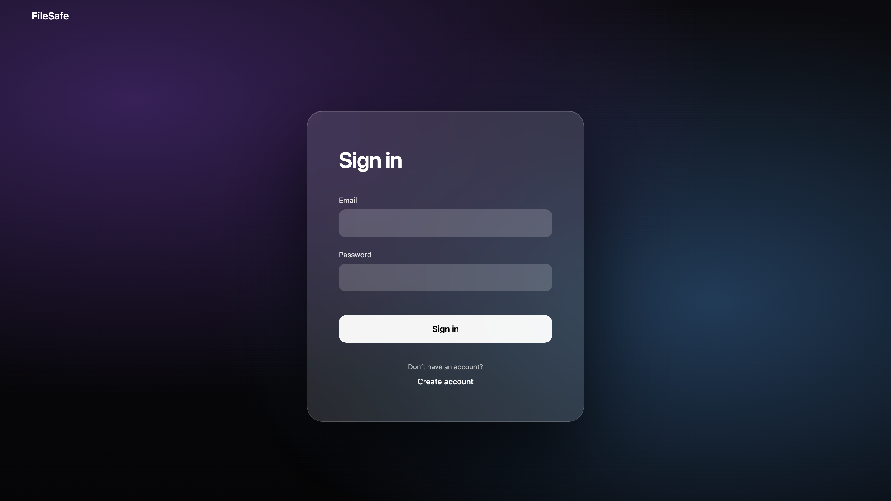
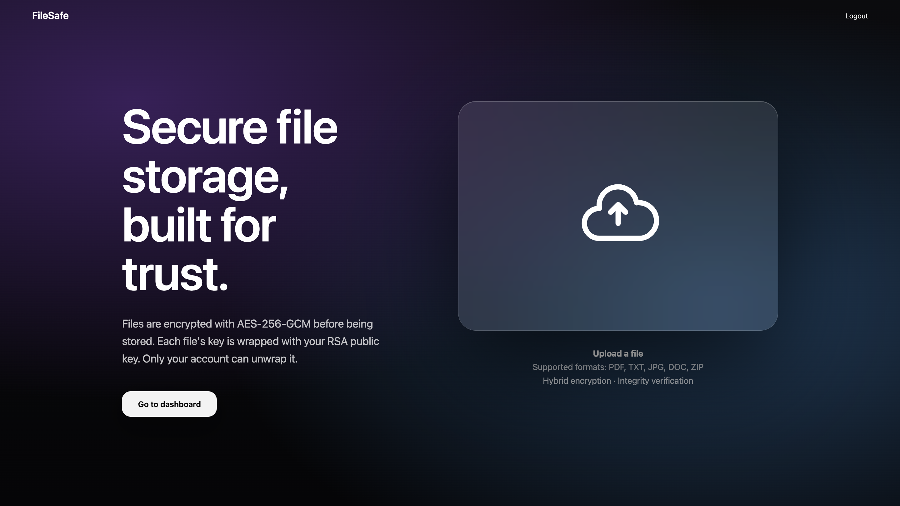
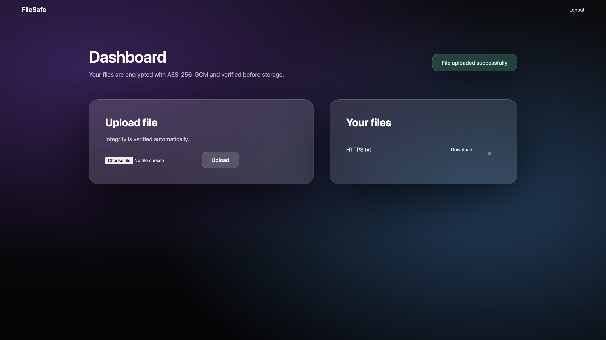
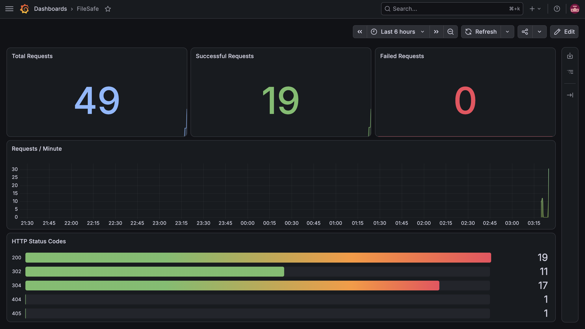

# FileSafe

FileSafe is a secure file storage application where uploaded files are
encrypted before being stored, ensuring each user's files remain
cryptographically isolated from every other user's. The application is
built with Flask and MySQL, deployed on AWS EC2 using Docker Compose and
Terraform, automated with GitHub Actions, and monitored using Prometheus
and Grafana.

**Live:** https://file-safe.duckdns.org

## Screenshots

| Sign In | Home | Dashboard | Grafana |
|---------|------|-----------|----------|
|  |  |  |  |

## Why FileSafe?

The goal of this project was to explore practical hybrid cryptography in a web application while applying modern DevOps practices such as containerization, Infrastructure as Code, CI/CD, and monitoring.

## Features

-   User registration and authentication
-   RSA-2048 key pair generated for every user
-   AES-256-GCM encryption with a unique key for every uploaded file
-   RSA-OAEP (SHA-256) wrapping of the AES encryption key
-   User-scoped file access and isolation
-   Secure file upload, download, and deletion
-   Docker Compose deployment
-   Infrastructure provisioning with Terraform
-   Automated CI/CD using GitHub Actions
-   Monitoring with Prometheus and Grafana

## Tech Stack

| Layer | Technology |
|-------|------------|
| Backend | Flask (Python) |
| Database | MySQL |
| Cryptography | Python `cryptography` (AES-256-GCM, RSA-OAEP) |
| Reverse Proxy | Nginx |
| Containerization | Docker Compose |
| Infrastructure | Terraform |
| Cloud | AWS EC2 |
| CI/CD | GitHub Actions |
| Monitoring | Prometheus & Grafana |

## Architecture

``` text
                    GitHub Actions
                           │
                           ▼
                        AWS EC2
                           │
Browser ── HTTPS ──► Nginx ─► Flask API ─► MySQL
                           │
                           ├── Encrypted Files (Disk)
                           └── RSA Private Keys (Separate Volume)
                           │
                           ▼
                    Prometheus ─► Grafana
```

Five containers are defined in `docker-compose.yml`:

-   MySQL
-   Flask API
-   Nginx
-   Prometheus
-   Grafana

## Cryptographic Workflow

The following workflow illustrates how FileSafe uses hybrid encryption to protect uploaded files and restore the original file during download.

``` text
User Upload
     │
     ▼
Generate AES-256 Session Key
     │
     ▼
Encrypt File (AES-256-GCM)
     │
     ▼
Encrypt AES Session Key (RSA-OAEP)
     │
     ▼
Store:
• Encrypted File (Disk)
• Wrapped AES Session Key (MySQL)
     │
     ▼
User Download
     │
     ▼
Decrypt AES Session Key (RSA Private Key)
     │
     ▼
Decrypt File (AES-256-GCM)
     │
     ▼
Original File Restored
```

## Encryption

The workflow above provides a high-level overview of the encryption process. The following implementation details explain how FileSafe encrypts, stores, and protects uploaded files.

When a user uploads a file, FileSafe generates a unique **AES-256-GCM** session key to encrypt the file before it is written to disk.

The AES session key is then encrypted using the uploading user's **RSA-2048 public key** with **RSA-OAEP (SHA-256)**. The encrypted AES session key is stored in MySQL, while the encrypted file is stored on disk.

As a result:

- Files are stored only in encrypted form.
- Every uploaded file uses its own unique AES session key.
- Only the owning user's RSA private key can decrypt the corresponding AES session key, ensuring users can access only their own files.

RSA private keys are stored on the server in a separate volume from the encrypted files.

FileSafe implements **server-side hybrid encryption**. Files are transmitted over HTTPS, encrypted on the server using AES-256-GCM, and protected with RSA-2048 key wrapping. Because the server stores the private keys required for decryption, this is **not** a zero-knowledge encryption system.

## Encryption Performance

| File Size (MB) | AES Encrypt (ms) | AES Decrypt (ms) | RSA Wrap (ms) | RSA Unwrap (ms) |
|---------------:|-----------------:|-----------------:|--------------:|----------------:|
| 1 | 4.24 | 0.75 | 0.43 | 1.31 |
| 5 | 5.27 | 4.23 | 0.16 | 1.17 |
| 10 | 8.87 | 8.86 | 0.15 | 0.85 |
| 25 | 21.45 | 21.19 | 0.12 | 0.67 |

AES encryption and decryption time increases approximately linearly with file size because the entire file is processed. RSA key wrapping remains nearly constant because RSA encrypts only the small AES session key rather than the file itself. This demonstrates why hybrid encryption is efficient for large files.

## Routes

| Method | Route | Notes |
|--------|-------|-------|
| GET / POST | `/signup` | Register user and generate RSA key pair |
| GET / POST | `/signin` | Authenticate user |
| GET / POST | `/dashboard` | View owned files and upload new files |
| GET | `/download/<file_id>` | Download and decrypt an owned file |
| POST | `/delete/<file_id>` | Delete an owned file |
| GET | `/logout` | Destroy session |

Authentication is enforced using `@login_required`. Download and delete operations additionally verify file ownership. Requests for another user's file return **404 Not Found** instead of exposing file information.

## CI/CD

Every push to the `main` branch triggers a two-stage GitHub Actions
workflow.

### Continuous Integration (CI)

-   Lints the project using **flake8**
-   Verifies the Flask application imports successfully
-   Builds the Docker image

### Continuous Deployment (CD)

-   Connects to the EC2 instance via SSH
-   Pulls the latest source code
-   Creates the `.env` file from GitHub Secrets
-   Deploys the updated application using:

``` bash
docker compose up -d --build
```

Workflow definition:

``` text
.github/workflows/deploy.yml
```

The CI pipeline validates code quality and build integrity. Automated
integration and end-to-end tests are not currently implemented.

## Infrastructure

Infrastructure is provisioned using Terraform and consists of:

-   AWS EC2 instance
-   AWS Security Group

``` hcl
resource "aws_instance" "filesafe_server" {
  ami           = "ami-006f82a1d5a27da54"
  instance_type = "t3.small"

  root_block_device {
    volume_size = 20
    volume_type = "gp3"
  }
}
```

The security group allows:

-   SSH (22)
-   HTTP (80)
-   HTTPS (443)
-   Prometheus (9090)
-   Grafana (3001)

## Monitoring

The Flask application exposes a `/metrics` endpoint using
`prometheus-flask-exporter`.

Prometheus scrapes metrics every 15 seconds while Grafana visualizes:

-   Total requests
-   Requests per minute
-   Successful requests
-   Failed requests
-   HTTP status distribution

These metrics were used during development and deployment to monitor application health, verify application traffic, and identify request failures.

## Run Locally

```bash
git clone https://github.com/MujthabaT/FileSafe.git
cd FileSafe
nano .env
docker compose up -d
```

| Service | URL |
|---------|-----|
| Application | http://localhost |
| Grafana | http://localhost:3001 |
| Prometheus | http://localhost:9090 |

## Project Structure

``` text
FileSafe/
├── .github/
│   └── workflows/
│       └── deploy.yml
├── screenshots/
├── static/
├── templates/
├── terraform/
├── app.py
├── database.sql
├── docker-compose.yml
├── Dockerfile
├── nginx.conf
├── prometheus.yml
└── requirements.txt
```

## Author

-   **GitHub:** https://github.com/MujthabaT
-   **LinkedIn:** https://www.linkedin.com/in/mujthabat
